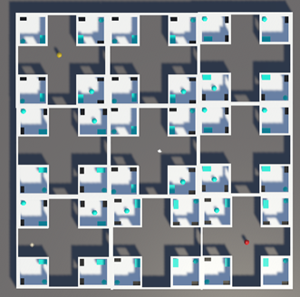

# AI-Director

[Here's a video that explains and demonstrates the project](https://www.youtube.com/watch?v=L_wyFUZwEG8)
  
Click [here](https://jt5519.github.io/AI-Director/) to play the game.
  

## Overview

The goal of this project was to build an AI Director to pace the level of stress/fear felt by the player. The game draws heavy inspiration from Alien: Isolation and puts the player in a similar situation where they are trapped in the game world with an inhuman killer on the prowl, with supernatural abilities. This killer enemy uses its long range, short range, and extreme-short-range vision sensors to hunt for the player. The game AIs (enemy AI and Director AI) do not cheat i.e.,the Director knows the exact location of the player and the enemy at all times, but never gives the enemy AI the player information it has. It only suggests the general vicinity of the player to the enemy AI. Beyond that, the enemy AI must use its own sensors to hunt the player.

The AI Director maintains a menace bar to measure how “menaced” the player is and appropriately decides whether to suggest a point in the vicinity of the player or a point far away from the player to hunt next. This way, using the menace bar and giving appropriate suggestions to the enemy AI, the director tries to balance the pacing of the game. An important point to note is that the Director only suggests, the Enemy AI takes the final call on what action it does next based on its current sensor data, the director's suggestion, and its own decision making algorithm.

 *Top view of the map. The player is the yellow capsule, and the enemy is the red capsule. The map has 9 quadrants and each quadrant has 4 rooms*  

 *First Person View as the player. The bottom right side has a top view minimap to better see the Director and Enemy AI behaviour. The top view camera should be disabled for the ideal game experience*  

## Design and Implementation

### The Enemy AI
#### Behaviours
The Enemy AI has 2 behaviours: Hunting and Prowling. Hunting is further split into active hunting and passive hunting.

Active Hunt: The enemy AI is in the active hunt state when its vision sensors see the player. The enemy AI will instantly transition from any state to the hunt state as soon as it senses the player. It actively chases the player until it gets to player OR the player manages to hide in time. If it does get to the player, it pauses in front of the player which is where ideally a death animation would play.

Passive Hunt: The enemy AI only switches to passive hunt if it was in the active hunt state and the player managed to hide in time. It frantically sweeps the area around the last spot it saw the player. If it does find the player it switches to active hunt again, else it gives up and listens to the director’s suggestions for what to do next.

Prowl: The enemy AI prowls a particular location that the director advises it to. It only does the prowling behaviour when it knows it doesn’t need to hunt. Depending on how menaced the player is, the director may advice the enemy AI to head to a location near the vicinity of the player (last known quadrant location) or away from the player (farthest quadrant from the player).

#### Technical Design
The Enemy AI executes all its behaviours via coroutines. The ***EnemyController.cs*** script attached to the enemy game object is responsible for controlling the AI based on what its vision sensors are detecting and what the director is suggesting. On Start, the script starts the *ActionCycle* Coroutine that is responsible for deciding and starting the appropriate behavior coroutines.

> The action cycle first checks if any of the vision sensors see the player, if they do, the *ActiveHunt* coroutine is started and that coroutine then takes over until the player is lost in the vision sensors.

> If the *ActionCycle* routine determines that the vision sensors do not see a target, it then checks if the enemy AI wants to set itself to a particular state. For example, when the *ActiveHunt* routine’s loop ends when the vision sensors do not see the player anymore, the ideal behaviour should be to sweep the immediate area, i.e., execute the passive hunt behaviour. So, the *ActiveHunt* coroutine sets a *NextState* variable to *stateNames.passiveHunt* (stateNames is an enum to encapsulate state indices). The *ActionCycle* sees this, and then sets the enemy AI state to whatever the *NextState* variable was set to.

> Finally, if the enemy AI hasn’t set it’s *NextState* variable either, the enemy AI takes the AI Directors advice on where to go and prowl next. The *ActionCycle* routine then sets the behaviour to whatever the Director suggests. The Director can only tell the enemy AI to prowl certain locations, which the director determines as apt to pace the game.

The *ActionCycle* routine also starts an *InterruptCheckRoutine* for states that allow themselves to be interruptable (state structure is covered further down the document). The *InterruptCheckRoutine* periodically checks if the player is visible and if it is, it sets the *StateChangeFlag* to true and immediately stops the currently executing behaviour (that is obviously interruptible) so that the *ActionCycle* routine may set the behaviour to *ActiveHunt*. A point to note here is that the state changing mechanism is controlled **solely** by the *ActionCycle* routine and behaviour routines may only set the *NextState* variable to have some control over the next state decision. **This ensures one central mechanism that controls all behaviour changes.**

*(To clarify, state is just a struct variable of the state type that encapsulate state properties. States are linked
to their behaviour coroutines using indexes)*

 *The enemy AI (looks menacing, doesn’t he?)*  

#### Navigation
The enemy AI is a navmesh agent and it uses Unity’s built in NavMesh system.

 *The baked NavMesh*  

#### Sensing
The enemy AI has 3 vision sensors: An extremely short range 360 degrees sensor, A short range 120 degree FOV sensor, and a long range 22.5 degree FOV sensor. Editor scripts visualise these FOV’s well. 

 *The Three sensing radii with their FOV lines. The innermost sensor has no FOV lines because it has a 360 degree FOV. Highlight the “Sense” game object that has the “Enemy” game object as its parent and expand the VisionSense script component in the inspector, for the FOV gizmos to show.*  

##### Technical Design
The ***VisionSense.cs*** script has 3 coroutines that run with varying periodicities, for each of the three vision sensors. The extreme short-range sensor checks its radius once every 0.1 seconds. 0.2 seconds for the short range FOV and 0.5 seconds for the long range FOV.

##### States
The enemy AI has 5 states. These are: activeHunt, passiveHunt, prowl, avoid and ignore. 
activeHunt, passiveHunt and prowl states are obvious from their respective behaviours described above. The avoid state is just for debugging clarity, so that when the director suggests a location far away from the player, the Debug.Log message for the current state explicitly states that the enemy AI is avoiding the player. The behaviour routine that the enemy runs in this avoid state is the same prowl behaviour routine that runs for the prowl state. Since for all intents, the enemy AI still thinks it is going to prowl the location the director gives it and doesn’t know that it is actively avoiding the player. The ignore state is just the default variable to set to that tells the ActionCycle routine that any state variable set to this value needs to be ignored. 

States are represented as structures. They have 3 attributes: stateName, agentSpeedInState and isInterruptable. The first two are exactly what their name suggests and the isInterruptable is what the ActionCycle routine checks before starting off the interrupt routine. The agentSpeedInState variable determines the speed of the enemy AI for the different states, the enemy AI is faster moving when it is actively or passively hunting the player and is slower otherwise.

  
### The AI Director
The AI Director is essentially a single script: ***DirectorAI.cs***. It is constantly measuring how menaced the player is and assigns locations for the enemy AI to prowl, that can be close to the player or far away from them.

#### Menace
How menaced the player is ranges from 0 to 100. The player is considered menaced if the menace value is over 75. If menaced, the player is only considered relaxed if the menace value decreases to lesser than 25. This creates a relaxation window between 75 to 25 at minimum and 100 to 25 at maximum. Parameters that affect Menace and how they affect Menace. There are 3 parameters that affect menace:
* ***Path Distance***: The Director has a PathCheck routine that periodically checks the navmesh path between the player and the enemy and calculates the path length. When the player is farther from the enemy AI than the enemy’s long-range vision radius, distance has a constant negative coefficient = -5/6. This value was chosen so that at minimum, the relaxation window lasts a minute. Since the minimum relaxation window is 50 menace points, a degradation of -5/6 per second makes it so that it takes 60 seconds to bring the menace down below 25. Distance is the only parameter that ever has a negative coefficient for the menace, that is why it gets the complete -5/6 weight. Other parameters either positively affect the menace or don’t affect it (coefficient = 0) When the distance is between the long-range and short-range radius the distance coefficient is positive and inversely proportional to the distance magnitude. It varies such that it has a maximum value of +5 when the player is at a short-range radius distance from the player.

*The formula is distance coeff = (1/distance) * shortFOVradius * 5*

When the distance is lower than the short radius fov, it has a constant value that equals the maximum
value for the function mentioned above, so it basically stays a constant +5 for any distance smaller
than the shortFOV radius.
* ***Enemy Visibility***: The Director periodically runs a VisibilityCheck routine that checks if the enemy is visible to the player. It does this by checking if the enemy is within the frustrum planes of the player’s FPS camera, and if it is, the director shoots a raycast from the player towards the enemy and checks if there are obstructions in the way. If the raycast hit’s the enemy AI, then the director considers the enemy visible to the player, else it considers the enemy is not visible. When visible, the visibility coefficient is positive and varies with the distance coefficient calculated above as:

*effectiveVisiblityCoeff = visibilityCoefficient * effectiveDistanceCoeff / maxPositiveDistCoeff;* 
*visibilityCoefficient by default is set to 2 (after some game balancing).* 
*effectiveDistanceCoefficient is the distance coefficient calculated above* 
*maxPositiveDistanceCoefficient is the maximum possible value for the distance coefficient = 5* 
* ***Enemy Hunt State***: When the enemy is actively hunting the player, the HuntCoefficient is 5, and when passively hunting the HuntCoefficient is 2. After these menace parameters are calculated, their added to the current menace value, which is clamped between 0 and 100. This menace updation happens once per second. After the menace is
updated, the director sets the placeholder variable the enemy AI has for director advice, as either stateNames.prowl or stateNames.avoid. The director also sets one of the quadrants as the vicinity of the player that the enemy AI uses as a starting point for its prowl.

#### Quadrant Suggestion
The director maintains 2 arrays, one that stores the transforms of all quadrants centre points and the other that stores the corner points of the 4 cornering quadrants.
When the director determines that the enemy AI should prowl near the player, it checks to find the quadrant that the player is closest to. It optimises this search by instantly returning any quadrant that has a distance to the player lesser than half of the quadrant dimension since this essentially means the player is within the bounds of that quadrant. When the director determines that the enemy should prowl away from the player, it checks the corner quadrant array to determine which corner quadrant is farthest from the player and sends the enemy AI that way.

  
### The Game World
The map has 9 quadrants with each quadrant containing 4 rooms. The rooms have 2 types of objects, generic ones (coloured in blue) and hiding spots (coloured in black).

 *The two kinds of generic objects, and the only type of hiding spot in the game*  

Both, the hiding spots as well as the generic objects are in the PoI (Point of Interest) layer for all collision and ray cast purposes. This is how the enemy AI knows that these are the objects to check out in the vicinity it is currently prowling.

The hiding spot is interactable to the player, and they can ‘Press E’ to enter and hide inside it, and similarly ‘Press E’ to exit the hiding spot. For the duration the player is inside the hiding spot, its layer is set to an invisible layer that collides or interacts with nothing, thus becoming invisible to the enemy’s vision sensors. The ***HideManager.cs*** script handles the hide state of the hide spot it is attached to and enables and disables the hide and exit messages.

  
### The Player Character
The player has a ***PlayerController.cs*** that is responsible for handling player movement and sets and resets the player hidden flag and the player visibility flag. 
The player has simple WASD movement controls and can switch to a slow walking speed when keeping the Left Ctrl key pressed. The player can look around with the mouse and press E to enter and exit hide spots all over the map.

 *The Player character, so bland, no personality!*  

The player has a NavMeshObstacle component (the green box) so that the enemy AI doesn’t try to fuse with the player when hunting. This ensures that the enemy AI stops a few units before the player’s body begins.

  
## Future Work
* The game is not a complete game yet. There are no win or lose conditions. The enemy AI when successful with its hunting, will only come stop in front of the player. This was intentional to test the AI Director but also because of time constraints. With more time, I would implement a game manager that created and managed a story on top of this game world thus giving the player some goals to accomplish in the game. 
* One technical aspect I want to implement is when the director suggests to the enemy AI to go to a far away quadrant, it doesn’t check the path the enemy AI takes to do so. So, there can be cases where the enemy AI temporarily heads towards the player instead of away, on their way to the far corner. While this doesn’t change the game experience too much, it is something I consider would improve the quality of the game pacing.
* Another technical aspect I want to implement is to give the enemy AI audio sensors as well. That way the enemy AI would sense the player if they ran around while being too close to the enemy and would have to slow walk to avoid alerting the enemy. As of now, the enemy only has visual senses, and the player makes no sound while walking or running.
* Finally, I want to make the game world slightly less symmetric with more unique points of interest and more polished assets.
